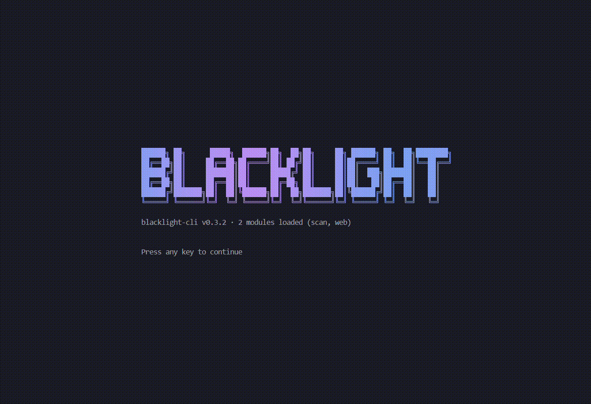
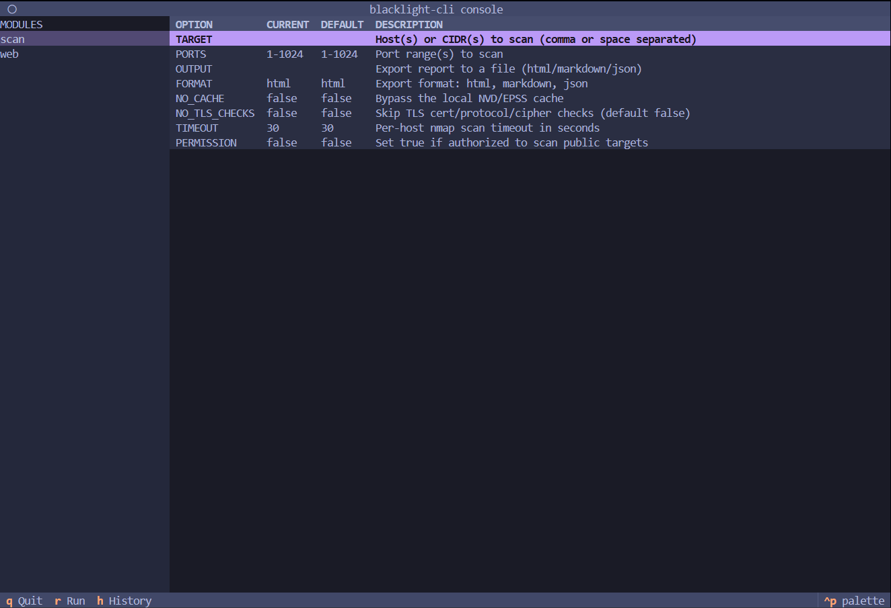
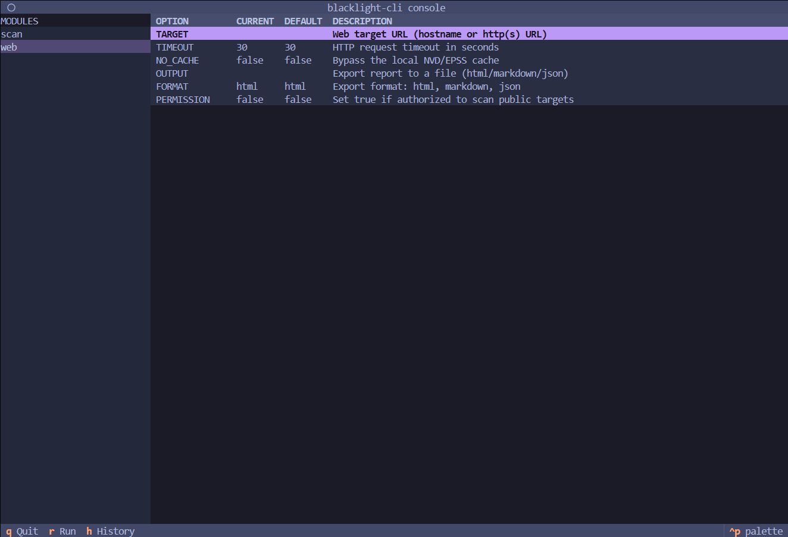

# blacklight-cli

Local network vulnerability scanner. Runs nmap service/version detection
(`-sV`), matches detected services against the NVD CVE database, overlays
exploitation intelligence (FIRST EPSS + CISA KEV), scores every host
0-100 by risk, and prints a severity-ranked report in the terminal with
optional HTML/Markdown/JSON export.

<p align="center">
  
</p>

> **Warning:** use only on systems you own or are explicitly authorized to
> test (e.g. a home lab, Metasploitable VM, or your own infrastructure).
> Scanning networks without authorization may be illegal. Every scan is
> logged to `~/.blacklight/scan.log` and recorded in the local scan history
> (`~/.blacklight/history.db`).

## Install

Requires **Python 3.11+** and the **nmap** binary (system package):

- Debian/Ubuntu: `sudo apt install nmap`
- macOS: `brew install nmap`
- Windows: `choco install nmap`

Then install the package (recommended: into an isolated environment):

```bash
pipx install blacklight-cli        # isolated env, recommended
# or: pip install blacklight-cli   # into your current env
```

## Usage

```
blacklight scan 192.168.1.0/24     network scan of hosts/CIDRs
blacklight web http://127.0.0.1    web application scan
blacklight history                 scan history, diffs, and risk trends
blacklight console                 interactive console
blacklight version                 show the installed version
blacklight                         show the banner and command help
```

### Network scans — `blacklight scan TARGET...`

```bash
# Scan a private subnet (default-deny: public ranges are blocked
# unless you pass --i-have-permission)
blacklight scan 192.168.1.0/24

# Scan specific ports, export an HTML report
blacklight scan 192.168.1.10 --ports 22,80,443 -o report.html

# Scan a public host you are authorized to test (interactive confirmation)
blacklight scan 203.0.113.10 --i-have-permission

# JSON export for scripting
blacklight scan 192.168.1.0/24 --format json -o scan.json
```

Options:

| Option | Description |
|---|---|
| `TARGET...` | One or more hostnames, IPs, or CIDRs (`192.168.1.10 192.168.2.0/24`). |
| `-p, --ports` | Port range(s) to scan. Default `1-1024` (e.g. `22,80,443`, `1-1000`, `80,443,8000-9000`). |
| `-o, --output` | Export the report to a file (HTML by default; `.md`/`.json` suffixes switch the format automatically). |
| `--format` | Export format: `html`, `markdown`, or `json`. Default `html`. |
| `--no-tls-checks` | Skip TLS certificate/protocol/cipher checks (default: on). |
| `--i-have-permission` | Confirm you are authorized to scan these targets (required for public ranges). |
| `--no-cache` | Bypass the local NVD/EPSS cache and fetch fresh data. |
| `--timeout` | Per-host nmap scan timeout in seconds. Default `30`. |

### Web scans — `blacklight web URL`

```bash
# Scan a local web app (private targets need no flag)
blacklight web http://127.0.0.1:8080

# Scan a public site you are authorized to test (interactive confirmation)
blacklight web https://example.com --i-have-permission

# Export
blacklight web http://127.0.0.1:8080 -o web_report.html
```

Options: `--i-have-permission`, `--no-cache`, `-o/--output`,
`--format` (`html` | `markdown` | `json`, default `html`), `--timeout`
(HTTP request timeout in seconds, default `30`).

Checks: missing security headers (X-Frame-Options, CSP, HSTS, ...), exposed
files and admin paths (`.git/config`, `.env`, `phpinfo`, `wp-admin`, backups),
directory listing, default install pages, error-based SQLi / reflected XSS /
command-injection probes on discovered GET parameters, and tech fingerprinting
(server/framework versions) fed through the same CPE → NVD CVE pipeline as
network scans. Web findings are scored by severity only — CVE-backed rows
show EPSS/KEV enrichment but it does not add to the web score (conservative
by design) — and exported alongside
network findings in HTML/Markdown/JSON reports.

### Scan history — `blacklight history`

Every network and web scan is recorded in a local SQLite database
(`~/.blacklight/history.db`): timestamp, target, authorization flag, host and
service counts, and the full finding set (severity, CVSS, EPSS, KEV, and the
fingerprint used for diffing).

```bash
# List the 20 most recent scans, newest first
blacklight history

# Diff the latest scan of a target against its previous scan
blacklight history diff 192.168.1.10

# Diff against the newest scan at/before a cutoff
blacklight history diff 192.168.1.10 --since 7d        # N days ago
blacklight history diff 192.168.1.10 --since 2026-07-01  # end of that day (UTC)

# List unchanged findings too (collapsed to a count line by default)
blacklight history diff 192.168.1.10 --verbose

# Risk-score trend for a target, oldest scan first
blacklight history trend 192.168.1.0/24
blacklight history trend 192.168.1.0/24 --host 192.168.1.20   # one host only
blacklight history trend 192.168.1.10 --limit 10              # newest 10 scans
```

What a diff shows:

- **NEW** findings — present in the latest scan, not in the baseline.
- **FIXED** findings — in the baseline, gone from the latest scan.
- **UNCHANGED** findings — present in both (a single count line unless
  `--verbose`).
- **Risk score delta** — latest minus baseline score, classified as
  `worsened` / `improved` / `unchanged` (delta beyond ±0.05). Network scores
  are the max host risk score in the scan; web scans use the web risk score.

Exit codes: `0` for success and for the no-history / no-previous-scan
messages; `1` for a corrupt history database or a bad `--since` value.

### Interactive console — `blacklight console`

A full-screen Terminal User Interface (TUI) with the same functionality as
the CLI. Launch `blacklight console` and press any key to dismiss the
animated splash banner:

<p align="center">
  
  
</p>

- **Main screen** — pick a module (`scan` / `web`) with `up`/`down` +
  `enter`, then edit its options in the table (`enter` opens an input
  prompt, `esc` cancels). `r` runs the active module, `h` opens scan
  history, `q` quits.
- **Run screen** — live progress bar and log stream while the scan runs,
  then a navigable findings table (host, port, service, CVE, severity,
  EPSS, KEV). `esc` returns to the main screen.
- **History screen** — the most recent scans; `enter` on a row shows the
  diff for that target, `t` shows its risk-score trend, `esc` goes back.
- **Authorization** — public-target permission prompts appear as a
  Yes/No modal (`y` / `n`).

Modules and their options:

| Module | Options |
|---|---|
| `scan` | `TARGET`, `PORTS`, `OUTPUT`, `FORMAT`, `NO_CACHE`, `NO_TLS_CHECKS`, `TIMEOUT`, `PERMISSION` |
| `web` | `TARGET`, `TIMEOUT`, `NO_CACHE`, `OUTPUT`, `FORMAT`, `PERMISSION` |

`PERMISSION` accepts `true`/`false`; set it `true` to authorize scanning
public targets (you will still be asked to confirm in the modal).

When stdin is piped (not a TTY), the console skips the TUI and reads
REPL-style lines instead — useful for scripting:

```bash
printf 'use scan\nset TARGET 192.168.1.10\nrun\nexit\n' | blacklight console
```

Commands: `help`, `modules`, `use <module>`, `show options`,
`set <OPTION> <value>`, `unset <OPTION>`, `run`, `back`, `history`,
`history <target>`, `trend <target>`, `exit` / `quit`. `history` and
`trend` are available without selecting a module.

### Version — `blacklight version`

```bash
blacklight version
# blacklight-cli 0.3.0
```

### NVD API key (optional)

A free NVD API key raises the rate limit from 5 to 50 requests per 30
seconds. Set it once: `export BLACKLIGHT_NVD_KEY=your-key`
(Request one at https://nvd.nist.gov/developers/request-an-api-key)

## How it works

1. **Scan** — shells out to `nmap -sV -oX -`, parses host/port/service/version.
2. **Match** — maps each service to a CPE identifier and queries NVD for
   affected CVEs (cached in `~/.blacklight/cache/`, refreshed weekly).
3. **Enrich** — adds FIRST EPSS exploitation probability and a badge for
   CVEs on the CISA Known Exploited Vulnerabilities list (feed refreshed
   daily).
4. **Score** — each host gets a 0-100 risk score:
   severity-weighted base (critical=20, high=10, medium=4, low=1, capped at
   60) + 10 per KEV finding (capped at 20) + max EPSS x 10; total capped at
   100.
   - **TLS checks** — on TLS-enabled ports, nmap's `ssl-cert` and
     `ssl-enum-ciphers` scripts inspect certificate expiry (expired = high),
     legacy protocols (SSLv3 = high, TLSv1.0 = medium, TLSv1.1 = low), weak
     ciphers (NULL/EXPORT/anonymous = high; RC4/single-DES = medium), and
     self-signed certs; findings score and report like service findings.
5. **Report** — rich terminal table sorted by CVSS, summary panel, and
   HTML/Markdown/JSON export.
6. **History** — every scan (network and web) is stored in
   `~/.blacklight/history.db`; `blacklight history diff` and
   `blacklight history trend` compare findings and scores between scans
   without re-scanning.

## Guardrails

- Only private RFC1918 ranges and loopback are scannable by default.
- Public targets require `--i-have-permission` plus an interactive
  confirmation.
- Every scan is logged with timestamp, target, and outcome to
  `~/.blacklight/scan.log` and recorded in `~/.blacklight/history.db`.

## Development

```bash
pip install -e ".[dev]"
pytest
```

## License

MIT
